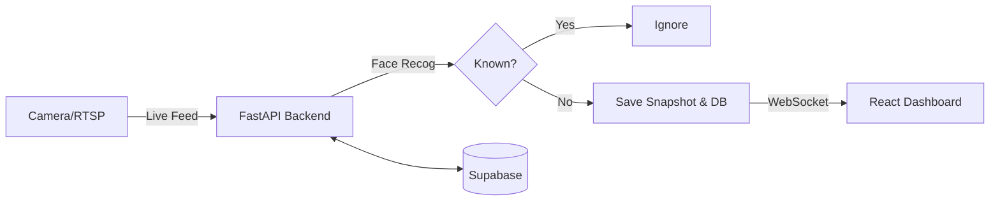

# 🛡️ FaceWatch: Real-Time Unknown Person Detection System

  
  
  
  
  
  

 

FaceWatch is a **Real-Time Unknown Person Detection** system designed for high-performance security monitoring. It streams video (webcam or RTSP CCTV), detects faces using `dlib` and `face_recognition`, compares them against a known database, and instantly alerts the dashboard if an unknown person is detected.

---

## 🌟 Key Features

- **👀 Real-Time Monitoring**: Process live video streams via Webcam or standard RTSP CCTV feeds.
- **🚨 Instant Alerts**: Detects unknown faces and triggers alerts on the dashboard instantly using WebSockets.
- **⚡ High Performance Inference**: Built on FastAPI with asynchronous background workers to ensure zero stream lag.
- **💾 Auto-Snapshots**: Captures and saves photos of unknown intruders for later review.
- **📱 Modern Dashboard**: A fully responsive, dark-mode ready dashboard built with React and TailwindCSS.
- **☁️ Supabase Powered**: Stores known face encodings and alert history securely.

---

## 🏗️ System Architecture

---

## 🚀 Deployment Guide

This project is structured for easy deployment with **Railway (Backend)** and **Vercel (Frontend)**.

### 1. ⚙️ Database (Supabase)
- Create a new project on [Supabase](https://supabase.com).
- Run the SQL script `facewatch-database.sql` in the Supabase SQL Editor.
- Create a new public storage bucket named `face-photos`.

### 2. 🚆 Backend Deployment (Railway)
1. Fork or push this repository to GitHub.
2. Import the project in [Railway.app](https://railway.app/).
3. Go to **Settings > Build** and set **Root Directory** to `/facewatch-backend/backend`.
4. Railway will automatically use the `Dockerfile` to install system dependencies (like `cmake`) and deploy the app.
5. Add the following **Environment Variables**:
   - `SUPABASE_URL`: Your Supabase Project URL
   - `SUPABASE_SERVICE_KEY`: Your Supabase Service Role Key
   - `FRONTEND_URL`: Your Vercel frontend URL

### 3. ▲ Frontend Deployment (Vercel)
1. Import the repository in [Vercel](https://vercel.com).
2. Set the **Root Directory** to `facewatch-frontend`.
3. Vercel will automatically detect **Vite**.
4. Add the **Environment Variable**:
   - `VITE_API_URL`: Your Railway Backend URL (e.g., `https://your-app.up.railway.app`)
5. Deploy!

---

## 💻 Local Development Setup

For local setup and testing, please refer to the detailed [facewatch-deployment.md](facewatch-deployment.md) guide included in this repository.

---

## 🛡️ License

This project is licensed under the MIT License.
